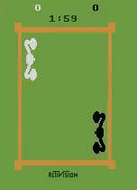
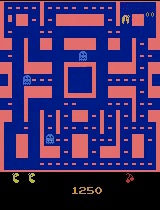
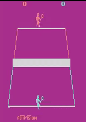
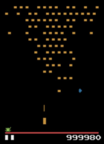

# Fractal AI: A Fragile Theory of Intelligence
[](http://github.com/badges/stability-badges)

**This repository is deprecated. If you would like to use any of the algorithms for your own research please refer to the [fragile framework](https://github.com/guillemdb/fragile).**

**It is only for educational purposes, and for providing code to the [Fractal AI](https://arxiv.org/abs/1803.05049) paper.** 







>Once you start doubting, just like you’re supposed to doubt, you ask me if the science is true.
>You say no, we don’t know what’s true, we’re trying to find out and everything is possibly wrong.

_–Richard P. Feynman, **The Pleasure of Finding Things Out**: The Best Short Works of Richard P. Feynman._

## Table of Contents

- [Abstract](#abstract)
- [Quick Start](#quick-start)
- [Running the code](#installation)
- [Benchmarks](#benchmarks)
- [Additional Resources](#additional-resources)
  - [Theoretical foundations](#theoretical-foundations)
  - [Blog](#blog)
  - [YouTube](#youtube)
  - [Related research](#related-research)
- [Cite us](#cite-us)
- [FAQ](#faq)
- [About the Authors](#about-the-authors)
- [Todo](#todo)
- [Bibliography](#bibliography)

## Abstract

Fractal AI ([arXiv#1](https://arxiv.org/abs/1803.05049), [arXiv#2](https://arxiv.org/abs/1807.01081)) is a theory for efficiently sampling state spaces. It allows one to derive new mathematical tools that could be useful for modeling information
using cellular automaton-like structures instead of smooth functions.

In this repository we present [Fractal Monte Carlo (FMC)](fractalai/fractalmc.py), a new planning algorithm derived from the first principles of [Fractal AI](https://arxiv.org/abs/1803.05049) theory. A FMC agent is capable of solving Atari-2600 games
under the [OpenAI Gym](https://github.com/openai/gym) several [orders of magnitude more efficiently](#benchmarks)
than similar planning algorithms, such as _Monte Carlo Tree Search (MCTS)_ **[[1](#bibliography)]**.

We also present a more advanced [Swarm Wave](fractalai/swarm_wave.py) implementation, also derived from Fractal AI principles, 
that allows one to solve Markov decision processes under a perfect/informative model of the environment. This implementation is far more efficient than FMC, effectively "solving" a substantial number of Atari games.

The code provided under this repository exemplifies how it is now possible to beat
some of the current state-of-the-art benchmarks on Atari games while generating a large set of top-performing examples
with little computation required, turning Reinforcement Learning (RL) into a supervised problem.

These new algorithms propose a new approach to modeling the decision space, while maintaining
control over any aspects of the agent's behavior. The algorithms can be applied
to all combinations of discrete or continuous decision and state spaces.

## Quick Start

To quickly understand the fundamentals of Fractal AI you can refer to the [Introduction to FAI](introduction_to_fai.md).
The document provides a brief explanation of the algorithms here presented and their
potential applications on the field of Reinforcement Learning.

To test how the Fractal Monte Carlo Agent performs on any Atari game you can refer to the [FMC example notebook](FMC_example.ipynb). This example allows us to run games using either the RAM content or the pixel render as observations.

To better understand how the Swarm Wave algorithm works in practice you can refer to the [Swarm Wave example notebook](Swarm_Wave_example.ipynb).

Pleas note [the authors](#about-the-authors) are open to discuss the ideas and code here presented under the
conceptual framework of Reinforcement Learning and its standard terminology.

## Installation

The code provided aims to be both simple and self-explanatory.
Requirements and instructions to set up the environment are provided below.

### Requirements

- Python 3. Python 2 is not supported nor currently expected to be supported.
- Python [numpy library](http://docs.scipy.org/doc/numpy/reference/?v=20180402183410).
- Python [OpenAI Gym [Atari]](https://github.com/openai/gym) **[[2](#bibliography)]**.
  - OpenAI Gym dependencies.
- _(Optional)_ [Jupyter Notebook](http://www.jupyter.org) for running the example notebooks provided.

### Installing dependencies

As a first step, install the dependencies as explained on the OpenAI gym documentation:

>To install the full set of environments, you'll need to have some system
>packages installed. We'll build out the list here over time; please let us know
>what you end up installing on your platform.
>In case you want to run the notebook:
>
>  ``pip3 install jupyter``
>
>On OSX:
>
>   ``brew install cmake boost boost-python sdl2 swig wget``
>
>On Ubuntu 14.04:
>
>    ``sudo apt-get install -y python-numpy python-dev cmake zlib1g-dev libjpeg-dev 
>xvfb libav-tools xorg-dev python-opengl libboost-all-dev libsdl2-dev swig libav-tools``

### Cloning and Installing the FractalAI Repository

On the terminal, run:

```bash
git clone git@github.com:FragileTheory/FractalAI.git
cd FractalAI
sudo pip3 install -e .
```

## Benchmarks

>It doesn't matter how beautiful your theory is, it doesn't matter how smart you are.
>
>If it doesn't agree with experiment, it's wrong.

_–Richard P. Feynman_

We used a standard set of 50 Atari-2600 games, common to all the planning algorithms articles 
found in the literature, to compare our implementation of the FMC algorithm against:

- **Standard Human**: a professional game tester after 2 hours of trainnig, as reported in **[[5](#bibliography)]**.
- **World Human Record**: the maximum score achieved by a human player, as reported in **[[8](#bibliography)]**.
- **Planning SOtA**: the best score achieved by any "State of the Art" planning algorithms (Full Tree, MCTS UCT, IW(1), p-IW(1), R.p-IW(1), 2BSF, BrFS), as reported in **[[12](#bibliography)]** **[[13](#bibliography)]** **[[14](#bibliography)]** **[[15](#bibliography)]** **[[16](#bibliography)]** **[[17](#bibliography)]**.
- **Hidden score limit**: many games do not support scoring above 1M and reset score down to zero after 999,999 is reached. In most cases the limit was totally unknow as no one -human or algorithm- had ever been able to reach this limit before. 

|                              | FMC Wins |   %  |
| :--------------------------- | :------: | :--: |
| FMC vs Standard Human        |  49 / 50 |  98% |
| FMC vs World Human Record    |  32 / 50 |  64% |
| FMC vs Planning SOtA (1)     |  50 / 50 | 100% |
| FMC vs Hidden score limit    |  16 / 50 |  32% |

(1) On average, the Swarm Wave version of FMC used 360 times fewer samples per action than the rest of planning algorithm, 
typically using 150k samples per action.

### Fractal Monte Carlo Agent Performance Table

The following table depicts the Fractal Monte Carlo Agent performance on each tested game.

| Game | Human Record | Planning SOtA | FMC |
|:--- | :---: | :---: | :---:|
| Alien | 251916 | 38951 | ***479940*** |
| Amidar | ***155339*** | 3122  | 5779 |
| Assault | 8647 | 1970  | ***14472*** |
| Asterix (*) | 335500 | 319667 | ***999500*** |
| Asteroids | 10004100 | 68345  | ***12575000*** |
| Atlantis | 7352737 | 198510  | ***10000100*** |
| Bank Heist | ***199978*** | 1171  | 3139 |
| Battle Zone (*) | 863000 | 330880  | ***999000*** |
| Bean Rider (*) | ***999999*** | 12243  | ***999999*** |
| Berzerk | ***1057940*** | 2096 | 17610 |
| Bowling | ***300*** | 69  | 180 |
| Boxing | ***100*** | ***100***  | ***100*** |
| Breakout | 752 | 772 | ***864*** |
| Centipede | 1301709 | 193799 | ***1351000*** |
| Chopper Command (*) | ***999900*** | 34097  | ***999900*** |
| Crazy Climber | 447000 | 141840  | ***2254100*** |
| Demon Attack (*) | ***999970*** | 34405  | ***999970*** |
| Double Dunk | ***24*** | ***24***  | ***24*** |
| Enduro | 3617.9 | 788  | ***5279*** |
| Fishing Derby | ***71*** | 42  | 63 |
| Freeway | ***34*** | 32 | 33 |
| Frostbyte (*) | 552590 | 6427 | ***999960*** |
| Gopher (*) | 120000 | 26297  | ***999980*** |
| Gravitar | ***1673950*** | 6520  | 14050 |
| Hero | ***1000000*** | 15280  | 43255 |
| Ice Hockey | 36 | 62  | ***64*** |
| Jamesbond | 45550 | 23070  | ***152950*** |
| Kangaroo | ***1436500*** | 8760  | 10800 |
| Krull | ***1006680*** | 15788  | 426534 |
| Kung fu master | ***1000000*** | 86290  | 172600 |
| Montezuma's Revenge | ***1219200*** | 500  | 5600 |
| Ms. Pacman (*) | 290090 | 30785  | ***999990*** |
| Name this Game | 25220 | 15410  | ***53010*** |
| Pong | ***21*** | ***21***  | ***21*** |
| Private Eye | ***103100*** | 2544  | 41760 |
| Q*Bert (*) | ***999975*** | 44876  | ***999975*** |
| River Raid | ***194940*** | 15410  | 18510 |
| Road Runner (*) | ***999900*** | 120923  | ***999900*** |
| Robotank | 74 | 75  | ***94*** |
| Seaquest (*) | 527160 | 35009  | ***999999*** |
| Space Invaders | ***621535*** | 3974  | 17970 |
| Star Gunner (*) | 77400 | 14193  | ***999800*** |
| Tennis | ***24*** | ***24***  | ***24*** |
| Time Pilot | 66500 | 65213  | ***90000*** |
| Tutankham | ***3493*** | 226  | 342 |
| Up and Down (*) | 168830 | 120200  | ***999999*** |
| Venture | ***31900*** | 1200  | 1500 |
| Video Pinball (*) | ***999999*** | 471859  | ***999999*** |
| Wizard of Wor (*) | 99900 | ***161640***  | 99900 |
| Zaxxon | ***100000*** | 39687  | 92100 |
 
 (*) Games with the "1 Million bug" where max. score is hard-limited.
 
#### Detailed Performance Sheet

We provide a more detailed Google Docs spreadsheet where the performance of the
Fractal Monte Carlo Agent is logged relative to the current alternatives.
In the spreadsheet we also provide the parameters used in each of the runs.

If you find any outdated benchmarks or for some reason you are unable to replicate
some of our results, please [open an issue](https://github.com/FragileTheory/FractalAI/issues)
and we will update the document accordingly.

- [Fractal AI performance sheet](https://docs.google.com/spreadsheets/d/1JcNw2L0YL_I2iGZPJ0bNKJshlTaqMuEl5CP2W5zie6M/edit?usp=sharing)

## Additional Resources

### Theoretical Foundations

[Fractal AI: A Fragile Theory of Intelligence](https://docs.google.com/document/d/13SFT9m0ERaDY1flVybG16oWWZS41p7oPBi3904jNBQM/edit?usp=sharing):
This document explains the fundamental principles of the Fractal AI theory in which our Agent is based.
We worked all the fundamental principles completely from scratch to build our own solution.
We try to be consistent with existing terminology, and this document should contain everything
you need to understand the theory. Comments on how to better explain the content are appreciated.

[Solving Atari Games Using Fractals And Entropy](https://arxiv.org/abs/1807.01081):
A short version of the article written by [Spiros Baxevanakis](https://twitter.com/spirosbax) and submitted -under very high uncertaintly- to NIPS2018. 

### Blog

 [EntropicAI, Sergio Hernández Cerezo's blog](http://entropicai.blogspot.com/):
 Here you can find the evolution of the research process for developing this algorithm,
 documented and explained, as well as experiments which aim to apply the theory to other fields of research.

### YouTube

[Fractal AI playlist](https://www.youtube.com/playlist?list=PLEXwXLT-a6beFPzal3OznPQC0pieccAle):
In the Youtube playlist you can find videos of the accomplishments over the years.
Besides the recordings Atari games using the Agent, you can find videos recorded using
a custom library that allows one to create different tasks in continuous control environments,
as well as visualizations of how the Agent samples the state space.

### Related Research

[GAS paper](https://arxiv.org/abs/1705.08691) **[[9](#bibliography)]**:
A manuscript describing an application of the Fractal AI theory on general optimization problems.
There are certainly better ways to apply the theory such problems, yet it illustrates why
code is better than maths to explain the theory. When trying to formalize it,
things can get really non-intuitive.

[Causal Entropic Forces by Alexander Wissner-Gross](http://alexwg.org/publications/PhysRevLett_110-168702.pdf) **[[10](#bibliography)]**:
The fundamental concepts behind this paper inspired the present research.
We develop our theory aiming to calculate future entropy more quickly and being able to
leverage the information contained in the Entropy of any state space, together with any potential function.

## Cite us

    @misc{1803.05049,
        Author = {Sergio Hernández Cerezo and Guillem Duran Ballester},
        Title = {Fractal AI: A fragile theory of intelligence},
        Year = {2018},
        Eprint = {arXiv:1803.05049},
      }

## FAQ

As questions regarding the research and methodology we will address them under the FAQ.

You can refer to the [FAQ document](FAQ.md).

## About the Authors

Authors:

- **[Sergio Hernández Cerezo](https://twitter.com/EntropyFarmer)**: Studied mathematics, works as programmer, dreams about physics.
- **[Guillem Duran Ballester](https://twitter.com/Miau_DB)**: Rogue scientist, loves learning and teaching. Currently looking for work opportunities related to AI.

The authors have developed the theory as personal side projects driven purely by intellectual curiosity.
Guillem worked on it while attending college, and Sergio while working as a programmer.
The authors are not part of academia, have no corporate affiliation and no formal track record.

All the time and resources involved came from the authors themselves, besides the support from:

- [HCSoft](http://hcsoft.net), which supported our research and believed the ideas since the very beginning.
- [source{d}](https://sourced.tech/), which kindly sponsored the project for 6 months.

We currently do not have the resources to further carry our research. We will gladly accept
contributions or sponsorships that allow us to continue working with what is our passion.

**Special thanks**: We want to thank all the people who has believed in us along the years.
Their patience, understanding and support made possible for this project to evolve to this point.

- Our families, [HCSoft](hcsoft.net), Guillem's parents: Joan and Francisca, [Eulàlia Veny](https://twitter.com/linguistsmatter), and Fina.
- The people at source{d}, specially [Eiso Kant](https://twitter.com/eisokant), [Waren Long](https://twitter.com/warenlg),
  [Vadim Markovtsev](https://twitter.com/tmarkhor), [Marcelo Novaes](https://twitter.com/marnovo),
  and [Egor Bulychev](https://twitter.com/egor_bu).
- Everyone who believed in our "alien math" since Guillem was in college, specially
  [José M. Amigó](http://www.umh.es/contenido/pdi/:persona_5536/datos_es.html), [Antoni Elias](https://twitter.com/eliasfuste),
  [Jose Berengueres](https://twitter.com/harriken), [Javier Ozón](https://twitter.com/fjozon),
  [Samuel Graván](https://twitter.com/Samuel__GP), and [Marc Garcia](https://twitter.com/datapythonista).

## Bibliography

 - **[1]**  Guo, Xiaoxiao and Singh, Satinder and Lee, Honglak and Lewis, Richard L and Wang, Xiaoshi. ***Deep Learning for Real-Time Atari Game Play Using Offline Monte-Carlo Tree Search Planning***. [NIPS2014_5421](http://papers.nips.cc/paper/5421-deep-learning-for-real-time-atari-game-play-using-offline-monte-carlo-tree-search-planning.pdf), 2014.

- **[2]**  Greg Brockman and Vicki Cheung and Ludwig Pettersson and Jonas Schneider and John Schulman and Jie Tang and Wojciech Zaremba. ***OpenAI Gym*** . [arXiv:1606.01540](https://arxiv.org/pdf/1606.01540.pdf), 2016.

- **[3]**  Marc G. Bellemare, Will Dabney Rémi Munos. ***A Distributional Perspective on Reinforcement Learning***. [arXiv:1707.06887](https://arxiv.org/pdf/1707.06887.pdf), 2017.

- **[4]**  Meire Fortunato, Mohammad Gheshlaghi Azar, Bilal Piot, Jacob Menick, Matteo Hessel, Ian Osband, Alex Graves, Vlad Mnih, Remi Munos, Demis Hassabis, Olivier Pietquin, Charles Blundell, Shane Legg. ***Noisy networks for exploration***. [arXiv:1706.10295](https://arxiv.org/pdf/1706.10295.pdf), 2018.
 
- **[5]**  Volodymyr Mnih & others. ***Human-level control through deep reinforcement learning***. [doi:10.1038/nature14236](http://www.davidqiu.com:8888/research/nature14236.pdf), 2015.
 
- **[6]**  Matthias Plappert, Rein Houthooft, Prafulla Dhariwal, Szymon Sidor, Richard Y. Chen, Xi Chen, Tamim Asfour, Pieter Abbeel, Marcin Andrychowicz. ***Parameter Space Noise for Exploration***. [arXiv:1706.01905](https://arxiv.org/abs/1706.01905), 2017.

- **[7]**  Tim Salimans, Jonathan Ho, Xi Chen, Szymon Sidor, Ilya Sutskever. ***Evolution Strategies as a Scalable Alternative to Reinforcement Learning***. [arXiv:1703.03864](https://arxiv.org/abs/1703.03864), 2017.

- **[8]**  ***ATARI VCS/2600 Scoreboard***. [Atari compendium](http://www.ataricompendium.com/game_library/high_scores/high_scores.html), 2018.

- **[9]**  Sergio Hernández, Guillem Duran, José M. Amigó. ***General Algorithmic Search***. [arXiv:1705.08691](https://arxiv.org/abs/1705.08691), 2017.

- **[10]**  Alexander Wissner-Gross. ***Causal entropic forces***. [Physical Review Letters](http://alexwg.org/publications/PhysRevLett_110-168702.pdf), 2013.

- **[11]**  Shane Legg ***Machine Super Intelligence***. [Doctoral Dissertation ](http://www.vetta.org/documents/Machine_Super_Intelligence.pdf), 2008.

- **[12]** Foley, Daniel John ***Model-Based Reinforcement Learning in Atari 2600 Games**. [Thesis](https://dspace.fandm.edu/handle/11016/24289), 2017.

- **[13]** Justin Fu, Irving Hsu ***Model-Based Reinforcement Learning for Playing Atari Games**. [Stanford report](http://cs231n.stanford.edu/reports/2016/pdfs/116_Report.pdf), 2016.

- **[14]** Xiaoxiao Guo et al. ***Deep Learning for real-time Atari game play using offline MCTS planning**. [NIPS-2014](https://web.eecs.umich.edu/~baveja/Papers/UCTtoCNNsAtariGames-FinalVersion.pdf), 2014.

- **[15]** Marc G. Bellemare, Yavar Naddaf, Joel Veness, Michael Bowling ***The Arcade Learning Environment: An Evaluation Platform for General Agents**. [arxiv:1207.4708](https://arxiv.org/abs/1207.4708), 2013.

- **[16]** Alexander Shleyfman, Alexander Tuisov, Carmel Domshlak ***Blind Search for Atari-Like Online Planning Revisited**. [IJCAI-16](https://www.ijcai.org/Proceedings/16/Papers/460.pdf), 2016.

- **[17]** Nir Lipovetzky, Miquel Ramirez, Hector Geffner ***Classical Planning with Simulators: Results on the Atari Video Games**. [IJCAI-15](http://ijcai.org/Proceedings/15/Papers/230.pdf), 2015.

- **[18]** Wilmer Bandres, Blai Bonet, Hector Geffner ***Planning with Pixels in (Almost) Real Time**. [arXiv:1801.03354](https://arxiv.org/abs/1801.03354), 2018.

