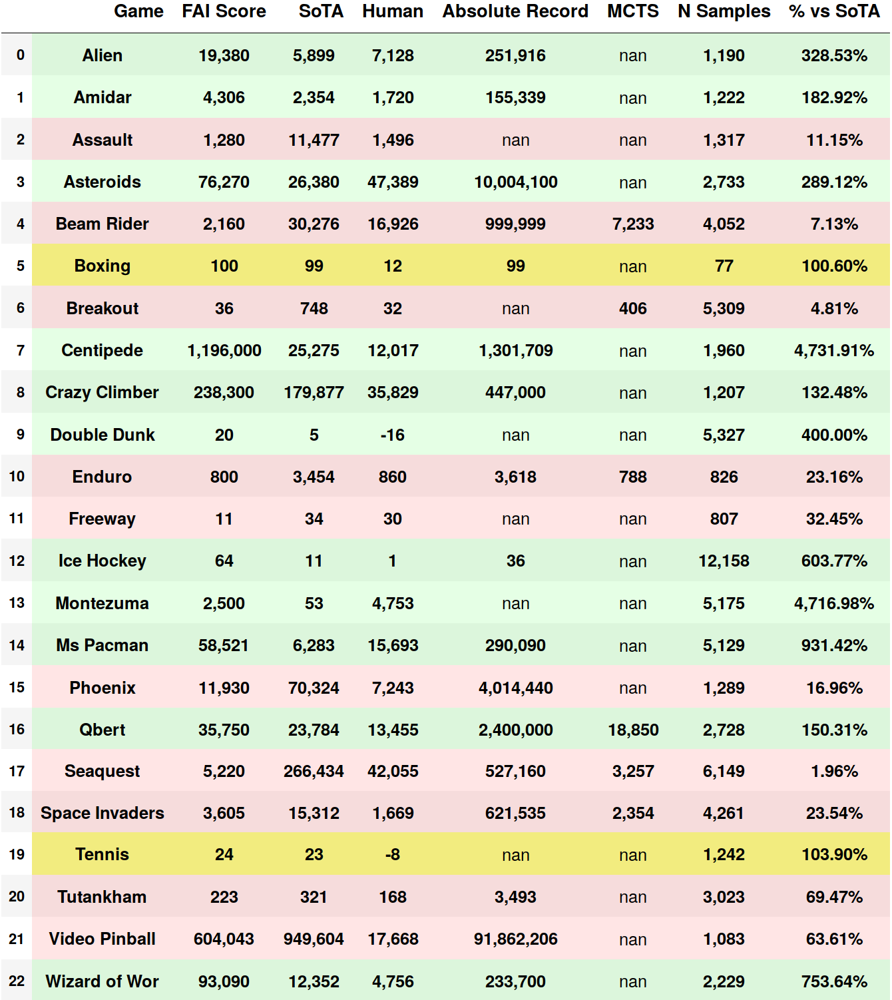
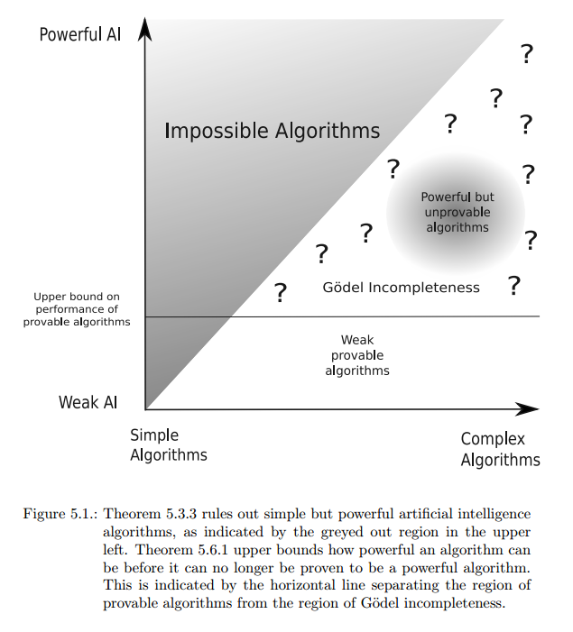

# Fractal AI: A Fragile Theory of Intelligence
### Sergio Hernández Cerezo and Guillem Duran Ballester

      

>“Once you start doubting, just like you’re supposed to doubt, you ask me if the science is true.
 You say no, we don’t know what’s true, we’re trying to find out and everything is possibly wrong.”
>
>  **Richard P. Feynman**, *The Pleasure of Finding Things Out*: The Best Short Works of Richard P. Feynman 

## Table of Contents

- [Abstract](#abstract)
- [Running the code](#installation)
- [Benchmarks](#benchmarks)
- [Additional Resources](#additional-resources)
  * [Theoretical foundations](#theoretical-foundations)
  * [Blog](#blog)
  * [YouTube](#youtube)
  * [Related papers](#related-papers)
- [Other tasks solved](#other-tasks-solved)
- [Other applications](#other-applications)
- [Conjectures on some of its properties](#conjectures-on-some-of-its-properties)
- [Cite us](#cite-us)
- [FAQ](#faq)
- [About](#about)
- [Bibliography](#bibliography)

## Abstract

[Fractal AI](https://docs.google.com/document/d/13SFT9m0ERaDY1flVybG16oWWZS41p7oPBi3904jNBQM/edit?usp=sharing) 
is a theory for general artificial intelligence. It allows to derive new mathematical
 tools that constitute the foundations for a new kind of stochastic calculus, by modelling
  information using cellular automaton-like structures instead of smooth functions.

In this repository we are presenting a new Agent, derived from the first principles of the theory,
 which is capable of solving Atari games several orders of magnitude more efficiently than other 
 similar techniques, like Monte Carlo Tree Search **[[1](#bibliography)]**. 

The code provided shows how it is now possible to beat some of the current state of the art
 benchmarks on Atari games, using less than 1000 samples to calculate each one of the actions when 
 MCTS uses 3 Million samples. Among other things, Fractal AI makes it possible to generate a huge database of
 top performing examples with very little amount of computation required, transforming 
 Reinforcement Learning into a supervised problem.
 
 The algorithm presented is capable of solving the exploration vs exploitation dilemma, while
 maintaining control over any aspect of the behavior of the Agent. From a general approach, 
 new techniques presented here have direct applications to other areas such as: Non-equilibrium
 thermodynamics, chemistry, quantum physics, economics, information theory, and non-linear
 control theory.
  
  
## Installation

This code release aims for simplicity and self-explainability. 
It should be pretty straightforward to run in Python 3. Python 2 is not supported.

It only needs numpy and [gym["atari"]](https://github.com/openai/gym) **[[2](#bibliography)]**, although we also recommend
 installing the Jupyter Notebook for running the example.

#### Installing dependencies
 
First, install the dependencies explained on the gym documentation.

>To install the full set of environments, you'll need to have some system
packages installed. We'll build out the list here over time; please let us know
what you end up installing on your platform.
>In case you want to run the notebook:
>
>  ``pip3 install jupyter``
>
>On OSX:
>
>   ``brew install cmake boost boost-python sdl2 swig wget``
>
>On Ubuntu 14.04:
>
>    ``sudo apt-get install -y python-numpy python-dev cmake zlib1g-dev libjpeg-dev 
>xvfb libav-tools xorg-dev python-opengl libboost-all-dev libsdl2-dev swig libav-tools``

#### Cloning and installing the repository

``git clone git@github.com:Guillem-db/FractalAI.git``

``cd FractalAI``

``sudo pip3 install -e .``

## Benchmarks

>It doesn't matter how beautiful your theory is, it doesn't matter how smart you are. 
>
>If it doesn't agree with experiment, it's wrong.
>
> **Richard P. Feynman**

The following benchmarks have been calculated in a laptop using a single thread implementation. 
Some of them can be replicated in real time, and others require up to 20k samples per action, but
anyone running this code should be able to get similar performance.

We show performance with respect to benchmarks widely accepted in the reinforcement learning community.

**SoTa**: It stands for "State of The Art", and it represents the maximum score value that we could
find for a given game in both  **[[3](#bibliography)]** and **[[4](#bibliography)]**.

   

In the following Google Sheet we are logging the performance of our Agent relative to the current alternatives.
If you find that some benchmark is outdated, or you are not capable of replicating some of our results, please
open an issue and we will update the document.

> [Fractal AI performance sheet](https://docs.google.com/spreadsheets/d/1JcNw2L0YL_I2iGZPJ0bNKJshlTaqMuEl5CP2W5zie6M/edit?usp=sharing)

#### Or just run the example and check by yourself!

## Additional Resources

### Theoretical foundations
[Fractal AI: A Fragile Theory of Intelligence](https://docs.google.com/document/d/13SFT9m0ERaDY1flVybG16oWWZS41p7oPBi3904jNBQM/edit?usp=sharing):
This document explains the fundamental principles of the Fractal AI theory in which our Agent is based. 
We tried very hard to build our own solution, so we worked all the fundamental principles completely from scratch.
This means that it should contain anything you need to understand the theory without further reading required.
Any comment on how to explain things more clearly will be welcome.

### Blog
 [Sergio's blog: EntropicAI](http://entropicai.blogspot.com.es/):
 Here we have documented and explained the evolution of our research process for developing this algorithm,
 and some experiments where we tried to apply our theory to other research fields.
 
### YouTube

[Fractal AI playlist](https://www.youtube.com/playlist?list=PLEXwXLT-a6beFPzal3OznPQC0pieccAle)
Here you can find some videos of what we accomplished over the years. Besides Atari games, you can find videos 
recorded using a custom library, which can be used to create different task in continuous control environments,
  and visualizations of how the Agent samples the state space.

### Related Papers

[GAS paper](https://arxiv.org/abs/1705.08691) **[[7](#bibliography)]**:
 We tried to publish a paper describing an application of our theory to general optimization,
but it was not published because our method "lacked scientific relevance", and there was no need for more algorithms that were not proven to work at a huge scale.
As we lack the resources to deploy our methods at a bigger scale, we were unable to meet the requirements for publishing. 

There are better ways to apply our theory to general optimization, but it is a nice example of why code is better than math to explain our theory. When you try to formalize it, 
it gets really non-intuitive.

[Causal Entropic Forces by Alexander Wissner-Gross](http://alexwg.org/publications/PhysRevLett_110-168702.pdf) **[[8](#bibliography)]**: 
The fundamental concepts behind this paper inspired our research. We develop our theory aiming to calculate future entropy faster,
 and being able to leverage the information contained in the Entropy of any state space, together with any potential function.
 
## Other tasks solved

Besides Atari games, we have also used our theory to solve different continuous control environments involving task such as:

- **Collecting rocks with a spaceship** ([Video](https://www.youtube.com/watch?v=HLbThk624jI) and
 [blog post](http://entropicai.blogspot.com.es/2016/04/understanding-mining-example.html)): 
    This agent can catch rocks using a hook that behaves like an elastic band. We are capable of
     sampling low  probability trajectories in such chaotic space state.
       
       
- **Multi agent environments**: It is aso possible to control multi agent environments, like
 [Maintaining a formation](https://www.youtube.com/watch?v=J9kW1lhT06A),
 [cooperating to achieve a shared goal](https://www.youtube.com/watch?v=DsvSH3cNhnE),
  or [fighting](http://entropicai.blogspot.com.es/2015/05/tonight-four-of-my-new-fractal-minded.html) against each other.
 A nice property of our methods is that their computational cost scales linearly with the number of agents. 
       

- **Stochastic simulations**: It can even [handle uncertainty in a continuous domain](http://entropicai.blogspot.com.es/2015/06/passing-asteroids-test.html?m=0).
You can also check this on Atari games by setting the clone_seeds parameter of the agent to False.

- **Multi objective and multi agent path finding**: We can solve multi objective path finding in nearly real time. [Video 1](https://www.youtube.com/watch?v=AoiGseO7g1I),
 [Video 2](https://www.youtube.com/watch?v=R61FRUf-F6M), [Blog Post](http://entropicai.blogspot.com.es/search/label/Path%20finding).

- **General optimization**: Here you can find a [visual representation](http://entropicai.blogspot.com.es/2016/02/serious-fractal-optimizing.html?m=0)
 of how our algorithm explores the state space.

## Other applications

- **Physics**: Physics is basically a path finding problem, so our theory can be thought as a sort of non-equilibrium statistical mechanics. 
Given that our algorithm is surprisingly good at path finding, we wonder how well it can be applied to solve Feynman path integrals.
 Conceptually, it is relatively simple to map some properties of a Swarm, to the properties of a wave function.
 If you used something similar to our agent to move around the gaussian packets that are used when sampling integrals, 
 maybe it would be easier to focus on regions with a meaningful contribution to the sum.
 
- **Deep Learning**: It is possible to use our theory to make Deep Learning more efficient, but
this code release does not focus on models. For now, it should be pretty clear that using FAI 
instead of MCTS is worth trying.
                    
- **Evolutionary strategies**: The principles of the theory also allow to design evolutionary strategies for training DNN,
 using something conceptually similar to what [Uber](https://eng.uber.com/deep-neuroevolution/) did.
  This is the way to go in case you want to solve Starcraft quickly without understanding the theory.
  Using this method, guarantees that you will end up with something you cannot control.
  If you try this in a properly scaled implementation without *perfect understanding*, a long term disaster is guaranteed.

- **Economics**: Our theory allow us to quantify and model the *personality* and *irrationality* of an agent, 
and it has non-equilibrium risk-control mechanisms. We bet someone will think of an interesting application.

- **Looks like Alien Math**: It is so weird that it almost qualifies as *"alien math"*. If you only knew this algorithm,
 you could pretty much arrive at the same conclusions as our current scientific knowledge arrives. 
 It is funny to think that Science without gradients is also possible.
 

## Conjectures on some of its properties

We cannot provide any formal proof about this algorithm, because we don't know any tool suitable for analyzing
 the far-from-equilibrium regime in which the Agent operates. These are just conjectures and they could be wrong.
 
 Any suggestion about how to prove our conjectures will be welcome. This list is non-exhaustive and it will be updated.
 
 **State Swarm**: Structure consisting of different states that interact with each other in order to build a causal cone. 
 The agent uses a Swarm to build a causal cone used to approximate the Q values of each action.
 
- ***It is possible to prove that this algorithm is unprovable with any known mathematical tools.***
  Maybe someone can proof that FAI is unprovable **[[9](#bibliography)]**.
 
   
 
- ***A State Swarm can leverage efficiently both the information contained in the physical structure of a given State Space (Entropy/Exploration), and the potential field associated with each state.***

  This means that we are not taking only into account "how good an state is", but also "how different an state is with respect to the others", effectively solving the exploration vs exploitation problem.
 
- ***This algorithm tends to achieve symmetry. In the limit, a swarm of states will be distributed proportionally to the space-time reward distribution of the space state.*** 

  If we fix all the states in the Swarm to share time, states distribution in each slice of the causal cone  will be proportional to its reward density distribution in the limit.
 If we do not fix the time, a Swarm will automatically adjust to also distribute the states symmetrically with respect to the time horizon.
  
- ***Given a uniform prior, this algorithm will never perform worse than random. And it will only perform randomly when no
 information can be extracted from the different states in the Swarm. Changing the prior will allow for worse than random games, but
 it will increase the performance in other problems.*** 

    Yes, we have read about the No Free Lunch Theorem, and we think this is an exception.

- ***P vs NP is not the right question to ask***. 
 
  If we happen to be right, and complexity is better measured using our methods, there would be NP hard problems which should be possible to solve in polynomial time. 
  Our complexity measure can classify some P and NP problems in the same category.

- ***There exits an arbitrary good approximation to [Density Functional Theory](https://en.wikipedia.org/wiki/Density_functional_theory) that scales linearly with the number of particles, and which uncertainty depends on the amount of computational resources used to calculate the approximation.*** 

  If you treat electrons as agents, you can use the minimum action principle to formulate a proper approximation of the potential
   function in almost any known physical problem. Then you can move the particles around as if you were solving a multi-agent environment. 
 Our method  scales linearly with the number of particles, so it gives a new approach to complex problems.
 
- ***Is it possible to create a functional AGI using only fractal methods***.
 With proper funding, a lot of effort, and very large amounts of computer power we think we can build an AGI within 10 years.

## Cite us

    @misc{HERE-ARXIV-ID,
        Author = {Sergio Hernández Cerezo and Guillem Duran Ballester},
        Title = {Fractal AI: A fragile theory of intelligence},
        Year = {2018},
        Eprint = {arXiv:HERE-ARXIV-ID},
      }

## FAQ

If there are any questions regarding our methods, we will be answering them here.
 
## About

We have developed this theory for the pleasure of finding thing out as a hobby, while I was at
 college, and Sergio worked as a programmer. Besides the 6 months [Source{d}](https://sourced.tech/) kindly
 sponsored us, we dedicated our personal time to this project making the most efficient use possible
 of the resources we had available.
 
 We are not part of academia, we have no affiliation and no track record.
 
 We don't have the resources to carry on further our research, but we will gladly accept any contribution or
  sponsorship that allows us to continue working in our passion.

- **[Sergio Hernández Cerezo](https://twitter.com/EntropyFarmer)**: Studied mathematics, works as programmer, dreams about physics.

- **[Guillem Duran Ballester](https://twitter.com/Miau_DB)**: Rogue scientist, loves learning and teaching. Currently looking for an AI-related job.

**Special thanks**: We want to thank all the people who has believed in us during this years.
 Their patience, understanding, and support made possible this work.
 
 - Our families, [HCSoft](hcsoft.net), Guillem's parents: Joan and Francisca, [Eulàlia Veny](https://twitter.com/linguistsmatter), and Fina. 
 
 - The people at sourced, specially [Eiso Kant](https://twitter.com/eisokant), [Waren Long](https://twitter.com/warenlg), [Vadim Markovtsev](https://twitter.com/tmarkhor),
  [Marcelo Novaes](https://twitter.com/marnovo), and [Egor Bulychev](https://twitter.com/egor_bu).
 
 - Everyone who believed in our Alien math since Guillem was in college, specially [José M. Amigó](http://www.umh.es/contenido/pdi/:persona_5536/datos_es.html), [Antoni Elias](https://twitter.com/eliasfuste),
 [Jose Berengueres](https://twitter.com/harriken), [Javier Ozón](https://twitter.com/fjozon), and [Samuel Graván](https://twitter.com/Samuel__GP).
 
 ## Bibliography
 - **[1]**  Guo, Xiaoxiao and Singh, Satinder and Lee, Honglak and Lewis, Richard L and Wang, Xiaoshi. 
***Deep Learning for Real-Time Atari Game Play Using Offline Monte-Carlo Tree Search Planning***. [NIPS2014_5421](http://papers.nips.cc/paper/5421-deep-learning-for-real-time-atari-game-play-using-offline-monte-carlo-tree-search-planning.pdf), 2014.

- **[2]**  Greg Brockman and Vicki Cheung and Ludwig Pettersson and Jonas Schneider and John Schulman and Jie Tang and Wojciech Zaremba.
***OpenAI Gym*** . [arXiv:1606.01540](https://arxiv.org/pdf/1606.01540.pdf), 2016.

- **[4]**  Marc G. Bellemare, Will Dabney Rémi Munos. ***A Distributional Perspective on Reinforcement Learning***. [arXiv:1707.06887](https://arxiv.org/pdf/1707.06887.pdf), 2017.

- **[5]**  Meire Fortunato, Mohammad Gheshlaghi Azar, Bilal Piot, Jacob Menick, Matteo Hessel, Ian Osband, Alex Graves, Vlad Mnih, Remi Munos, Demis Hassabis,
 Olivier Pietquin, Charles Blundell, Shane Legg. ***Noisy networks for exploration***. [arXiv:1706.10295](https://arxiv.org/pdf/1706.10295.pdf), 2018.
 
- **[6]**  Volodymyr Mnih & others. ***Human-level control through deep reinforcement learning***. [doi:10.1038/nature14236](http://www.davidqiu.com:8888/research/nature14236.pdf), 2015.
 
- **[7]**  ***ATARI VCS/2600 Scoreboard***. [Atari compendium](http://www.ataricompendium.com/game_library/high_scores/high_scores.html), 2018.

- **[8]**  Sergio Hernández, Guillem Duran, José M. Amigó. ***General Algorithmic Search***. [arXiv:1705.08691](https://arxiv.org/abs/1705.08691), 2017.

- **[9]**  Alexander Wissner-Gross. ***Causal entropic forces*** . [Physical Review Letters](http://alexwg.org/publications/PhysRevLett_110-168702.pdf), 2013.

- **[10]**  Shane Legg ***Machine Super Intelligence***. [Doctoral Dissertation ](http://www.vetta.org/documents/Machine_Super_Intelligence.pdf), 2008.